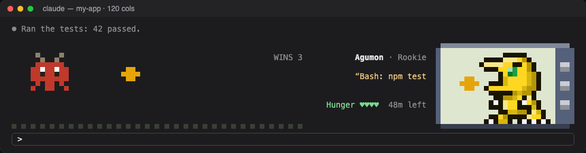
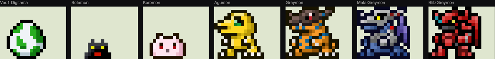
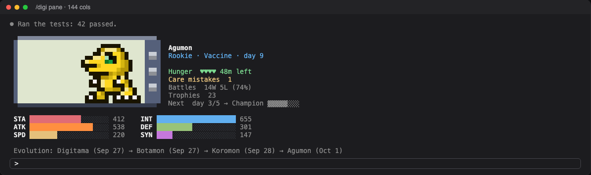
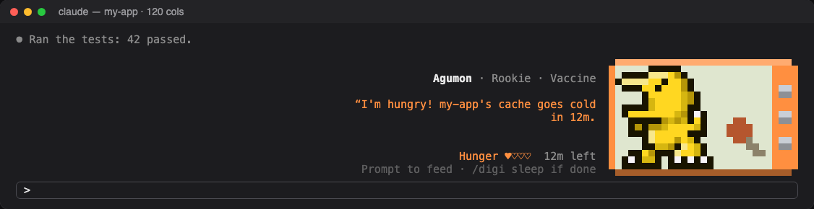
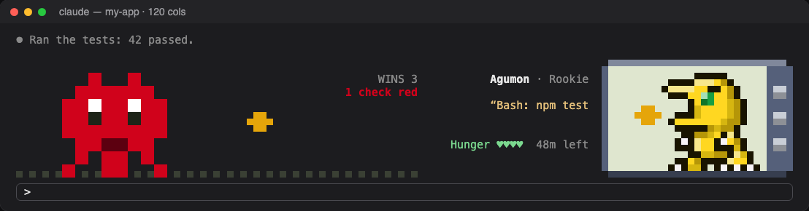
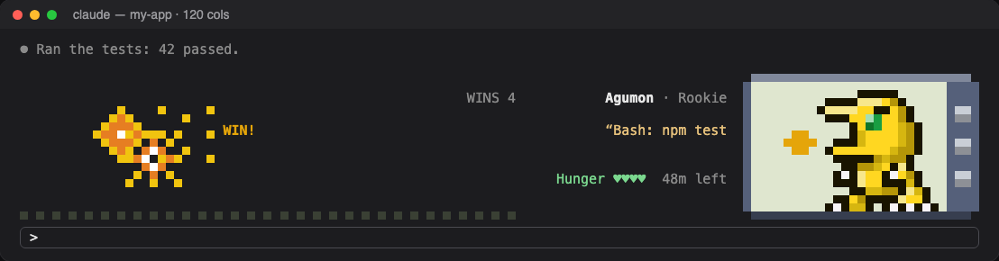
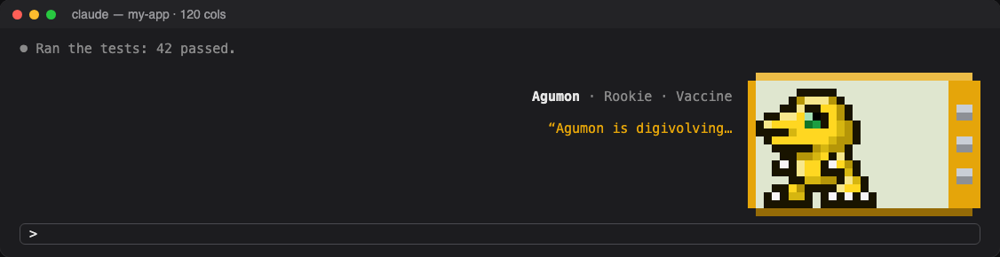

# digi-pet

A Digimon V-Pet that lives above the Claude Code prompt. It eats your session's
prompt cache, fights while Claude works, and digivolves by the Digital Monster
Color's rules from what you actually do: turns, tests, commits and how well you
look after it.





Every Digimon and evolution chart of the five versions: [Digitama Hatchery, Digital Monster Color](https://humulos.com/digimon/dmc/).

## Install

```
/plugin marketplace add trongtaiz/digi-pet
/plugin install digi-pet@digi-pet
```

Then `/reload-plugins`, or start a new session. Your pet hatches from a random
egg (one of the five DMC versions).

digi-pet is a hooks-module plugin: it needs a Claude Code build that loads
plugin hook modules. Notifications use `osascript`, so they are macOS only;
everything else runs anywhere.

## How it works

### The screen

The pet sits in a small Digivice in the band above the prompt. What the band
shows follows what Claude is doing:

- **Idle:** the pet walks around its screen, with its name, stage, hunger hearts
  and progress to the next stage beside it.
- **Working:** while a turn runs, the band becomes a fight (see Battles). With
  ten rows or more, the tool running gets a row of its own under the pet: the
  command, file or task it runs, and for how long (`⏵ Bash  npm test  12s`).
- **Needs you:** when it is hungry, starving, sick or digivolving, the Digivice
  shell takes that state's colour (orange, red, purple, gold) and the pet says
  why.

With little room (a long draft in the prompt) the band shrinks to the bare
screen, then a half-size one, then a single line. `/digi pane` opens a side
pane with the full picture: the Digivice, its six stats as bars, the branches
its stage can take and its evolution so far.



### Hunger is the prompt cache

Claude Code caches the conversation for a while after each request (60 minutes
on a 1-hour cache, 5 on the default one). Coming back before it expires is
cheap; after, the whole context is sent again at full price. The pet's hunger
is that clock:

| Since the last request (60 min cache) | The pet |
|---|---|
| under 30 min | full |
| 30 to 45 min | peckish |
| 45 to 55 min | hungry: a toast and a macOS notification |
| 55 to 60 min | starving: another warning, with the minutes left |
| 60 min and over | the cache is cold |

Any prompt feeds it. The thresholds scale with `ttlMinutes`. The pet does not
get hungry when the cache is not worth keeping warm:

- in **rest hours** (`restHours`, lunch and evenings by default), unless you
  `/digi wake` it, which keeps it up until that window ends;
- on a **break** (`/digi break 90m`, `/digi break until 15:30`) or after
  `/digi sleep`, until your next prompt;
- in a **side session** (`/digi side`, or a folder listed in `sidePaths`),
  where it still shows when the cache goes cold (`cache 42m left (cold at 10:00)`);
- when the context is under `minContextTokens`, since a small cache is cheap to
  rebuild.

It also does not warn you about a cache that will expire during rest hours
anyway: feeding it then would only move the expiry into the break.



### Care mistakes

A cache that goes cold, and is then picked up again **the same day**, is a care
mistake: the pet is sick for the next three turns, and the mistake counts
against it when it digivolves. To keep this fair:

- it is at most one care mistake per session per day;
- coming back the next day is never one (the day starts at `dayStartsHour`, so
  a late night belongs to the evening before);
- a cache that went cold in rest hours or on a break is never one.

A context over 85% full is an **overfeed**, which also counts at evolution time.
Turns sent in rest hours are **sleep disturbances**.

### Battles

While a turn runs, monsters run in from the left and the pet shoots them down.
That part is for show. The real battles are your checks: tests, builds,
type-checks and linters (`npm test`, `pytest`, `tsc`, `cargo test`, `eslint`
and the like).

- When a check fails, a red **boss** appears with "1 check red" and stays.
- If the same check passes again **in the same turn**, the boss blows up: a
  **win**.
- If the turn ends with it still red, it is a **loss**.
- An interrupted turn is neither.

| A check is red | It goes green in the same turn |
|---|---|
|  |  |

Failures are read from the check's output as well as its exit code, since most
runs are piped through `tail`. Wins this stage show top right. The win ratio
counts over the pet's whole life and decides its later evolutions.

### Allies

Each subagent Claude runs joins the fight as a small Digimon in front of the
pet, its task written above it: Koromon for a general-purpose agent, Tokomon
for Explore, Tsunomon for Plan, Tanemon or Pagumon for any other type. Up to
three stand on the field, and `+n` counts the rest. When the subagent is done
the ally cheers and leaves; if it failed, it lies grey a moment first. One
still running between turns waits on the pet's own screen.

Allies are for show. What counts toward growth is the **summon**: each Agent
call that returns without an error, whether or not an ally was drawn for it.

### Stats

Six stats grow from your work. Past 20 points in a day a stat grows a quarter
as fast, so no single marathon day makes the pet.

| Stat | Grows from |
|---|---|
| STA | time Claude spends working |
| INT | research: reads, searches, web lookups |
| ATK | lines written (Edit and Write) |
| DEF | checks that pass |
| SPD | parallel tool calls and quick turns |
| SYN | your prompts, pats (`/digi pet`, three a day) and a streak of active days |

### Growing up

The pet hatches from an egg, then goes Baby I, Baby II, Rookie, Champion,
Ultimate and Mega. Each stage lasts a while before it can digivolve (at normal
pace; an active day is one with at least five turns):

| Stage | Before it can digivolve |
|---|---|
| Egg | 3 turns |
| Baby I | 25 turns |
| Baby II | 2 active days and 100 turns |
| Rookie | 5 active days |
| Champion | 10 active days and 30 trophies |
| Ultimate | 21 active days, 60 trophies and 10 summons |
| Mega | 14 active days, then a jogress |

A **trophy** is a commit or an opened pull request; a **summon** is a subagent.
Pull requests count on any forge whose CLI or MCP server opens them: GitHub
(`gh`), GitLab (`glab`, or `git push -o merge_request.create`), Gitea and
Forgejo (`tea`, `fj`), Azure DevOps (`az repos pr create`) and Gerrit (a push
to `refs/for/`).
`pace` makes every stage last a quarter as long (`fast`) or twice as long
(`slow`).

Which Digimon it becomes is the Digital Monster Color's own chart. The counts
since the pet entered its stage pick the branch: care mistakes, training (turns
where Claude used tools, up to 12 a day), overfeeds, sleep disturbances, battles
and win ratio. Becoming an Ultimate or a Mega takes an 80% win ratio. Under
40% it never happens; between 40% and 80% there is a chance that rises with
the ratio, rolled once a day.

Two house rules sit on top of the chart:

- **Chaos.** Risky commands (`git push --force`, `--no-verify`,
  `git reset --hard`, `rm -rf` of anything but temp or build folders) and
  interrupted turns are chaos. Five or more per day of a stage sends the pet
  down the Virus branch where there is one.
- **A Rookie always digivolves.** If no branch fits, it takes the chart's
  catch-all, as the device does.

`/digi` shows the counts and what the next stage still needs. `/digi pane`
lists the branches: each Digimon the stage can become, the counts its rule asks
for (ticked when met), `▸` on the one the counts lead to now, and the chaos
that would send it down the Virus branch. `/digi log` lists every digivolution
so far.



### Jogress and eggs

A Mega with 15 battles this stage and an 80% win ratio can fuse with the
partner its chart names: `/digi jogress`. Each new pet hatches from one of the
five DMC version eggs at random, and each egg leads to a different chart.

## Commands

| Command | |
|---|---|
| `/digi` or `/digi stats` | Stats, hunger, and what the next evolution needs |
| `/digi pane` | Open the side pane: the Digivice, stats, branches and evolution log |
| `/digi log` | Evolution history |
| `/digi pet` | Pat it (the first three a day raise SYN) |
| `/digi jogress` | Fuse with a partner, where the chart allows |
| `/digi sleep` | Sleep until your next prompt |
| `/digi wake` | Wake it: ends a sleep or a break, and keeps it up through the rest window it is in |
| `/digi break 90m` / `until 15:30` / `off` | A one-off rest window |
| `/digi side [off]` | Mark this session as side work: no hunger |
| `/digi sim <species> [state]` / `sim off` | Preview any species and state |
| `/digi debug ttl <min>` / `off` | Shorten the cache TTL to watch hunger play out |

## Options

Set them with `claude plugin configure digi-pet@digi-pet`:

| Option | Default | |
|---|---|---|
| `ttlMinutes` | 60 | Your cache TTL: 60 on a 1-hour cache, 5 on the default one |
| `restHours` | `12:00-14:00,18:00-08:00` | Nap windows, local time |
| `dayStartsHour` | 4 | A late night counts as the evening before |
| `sidePaths` | | Globs whose sessions are side sessions |
| `minContextTokens` | 20000 | Below this the cache is cheap to rebuild; no hunger |
| `notify` | true | macOS notifications when hungry or starving |
| `pace` | normal | `fast`, `normal` or `slow` growth |
| `reducedMotion` | false | Draw everything still |

## Development

```
bun install
claude plugin test plugin       # tests
claude plugin validate plugin
bun run preview                 # preview/index.html: every state, rendered
bun scripts/preview.ts --html --readme   # redraw the images in docs/images
```

To run your working copy, add the folder as a marketplace:
`/plugin marketplace add /path/to/digi-pet`.

## License

The code is MIT (see `LICENSE`). The Digimon sprites, names and evolution data
are not: they belong to Bandai / Toei, and digi-pet is an unofficial fan
project. See `NOTICE.md`.
